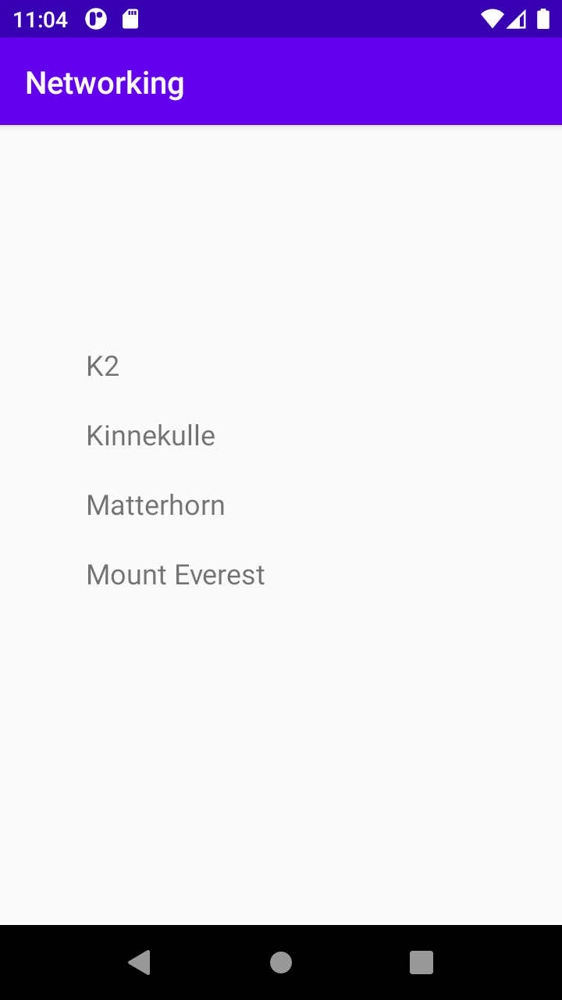

# Rapport

Efter att ha skapat min fork la jag till en RecyclerView till layouten för att kunna visa upp datan som jag vill 
hämta från ett URL, och jag gav även applikationen möjligheten att använda internet

<uses-permission android:name="android.permission.INTERNET" />

Jag skapade en Arraylist java fil, kallade den mountain och formade den för att kunna ta in informationen som URL 
länken lädde till. Jag skapade även java filer för en Adapter och en Viewholder som jag fyllde in senare, Adaptern 
la jag till som ett variabel i MainActivity.
Sedan gjorde jag lite småändringar, gav recyclerview ett id och fixade error meddelanden, la även till en ny 
version av gson. Jag använde datan i Mountain.json filen tillfälligt och parsade den men hjälp av gson.

import com.google.gson.Gson;
import com.google.gson.reflect.TypeToken;
import java.lang.reflect.Type;
import java.util.ArrayList;
import java.util.List;
.
@Override
public void onPostExecute(String json) {
Log.d("MainActivity", json);
Gson gson = new Gson();
Type type = new TypeToken<List<Mountain>>() {}.getType();
List<Mountain> listOfMountains = gson.fromJson(json, type);
.
    for (Mountain mountain:listOfMountains){
    Log.d("MainActivity", mountain.getName());
    }
}

Jag försökte sedan lägga in den parsade datan in i Mountains.java filen men emulatorn började krasha, det tog lång 
tid och mycket hjälp men tillslut löstes problemet genom att initiera min arrayList tidigare i koden, eftersom jag 
hade försökt använda datan när den fortfarande var null. Efter det bytte jag från att ta datan ifrån json filen 
till att hämta den från URLen och sedan var jag klar.

private final String JSON_URL = "https://mobprog.webug.se/json-api?login=brom";
private final String JSON_FILE = "mountains.json";
private ArrayList<Mountain> mountainList = new ArrayList<Mountain>();;

